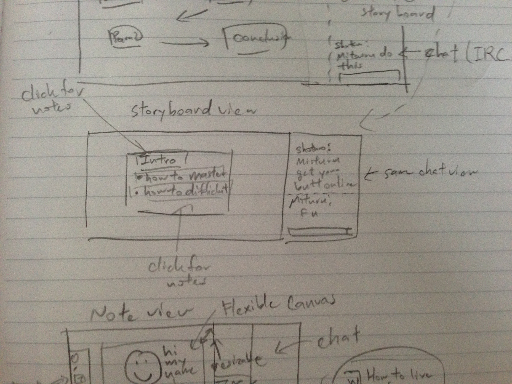

# Resources for Views #

## Full Application View (Rough Sketch) ##


## Table of Contents ##

1. [Selection View](#selection-view)
2. [StoryBoard View](#storyboard-view)
3. [Detail View](#detail-view)
4. [Canvas View](#canvas-view)
5. [Other References](#other-references)

-------------------------------------------------------------------------------


# Selection View #

1. [Image](#image)
2. [Resources](#resources)
3. [Notes](#notes)

## Image ##


## Resources ##

**TODO: Add URLs for reference**

## Notes ##

**TODO: Add notes when working**

[back to top](#table-of-contents)


-------------------------------------------------------------------------------


# StoryBoard View #

1. [Image](#image)
2. [Resources](#resources)
3. [Notes](#notes)

## Image ##


## Resources ##

**TODO: Add URLs for reference**

## Notes ##

**TODO: Add notes when working**

[back to top](#table-of-contents)

-------------------------------------------------------------------------------


# Detail View #

1. [Image](#image)
2. [Resources](#resources)
3. [Notes](#notes)

## Image ##



## Resources ##

**TODO: Add URLs for reference**

## Notes ##

**TODO: Add notes when working**

[back to top](#table-of-contents)


-------------------------------------------------------------------------------


# Canvas View #

1. [Image](#image)
2. [Resources](#resources)
3. [Notes](#notes)

## Image ##


## Resources ##

1. [Complete tutorial on basic HTML 5 canvas creation](http://www.williammalone.com/articles/create-html5-canvas-javascript-drawing-app/)

## Notes ##

### Board Redrawing ###
Some thoughts:
- Need to worry about concurrency (eventually)
- Need to find a better way then the link provided above (space concerns)
- Find a way to implement dirty rectangles instead

[back to top](#table-of-contents)

-------------------------------------------------------------------------------

# Other References #

## General HTML ##

1. [Free Icons](http://www.flaticon.com/)
2. [Very Good WebAPI documentation (js, css, html, etc.)](https://developer.mozilla.org/en-US/)

## Running AngularJS locally ##
1. [Get Node.js](https://nodejs.org/download/)
2. Run ```sudo npm http-server -g``` to install http-server
3. Browse to ```/path/to/PLMApp/app/```
4. Run ```http-server ./```

[back to top](#table-of-contents)
